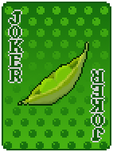

# Table of Contents

- [Emporium](#emporium)
- [Features](#features)
- [What's Coming](#whats-coming)
- [Dependencies](#dependencies)
- [Installation](#installation)
- [License](#license)

# Emporium

**Emporium** is a vanilla-style content mod for **Balatro**, enhancing the gameplay experience with new jokers, seals, consumables, booster packs, and more. This mod is designed to add fresh content through the new wax cards and custom seals, while maintaining the core feel of the base game.

## Features

Currently, <b>Emporium</b> adds the following to <b>Balatro</b>:

<b>Jokers</b>: 30 new jokers, each with unique abilities and effects.

<ul style="margin-top: 10px;">
    <li><b>Shadow Joker</b>: +20 Mult if played hand is a Two Pair and contains only Spades and Clubs</li>
    <li><b>Crimson Joker</b>: +20 Mult if played hand is a Two Pair and contains only Diamonds and Hearts</li>
    <li><b>Scattered Joker</b>: +5 Mult for every unique suit scored, Wild cards always give this bonus</li>
    <li><b>Nomad Joker</b>: +5 Mult for every unique hand played this run</li>
    <li><b>Spirited Joker</b>: +10 Mult per Spectral Card used while this Joker is held</li>
    <li><b>Ethical Joker</b>: X1.25 Mult if played card is even, X0.75 Mult if played card is odd</li>
    <li><b>Crooked Joker</b>: X1.25 Mult if played card is odd, X0.75 Mult if played card is even</li>
    <li><b>Unqualified Joker</b>: This Joker gives X1.5 Mult if 4 or more cards are scored in a hand</li>
    <li><b>Spite Joker</b>: X1.2 Mult for every card held in hand while scoring</li>
    <li><b>Gold Digger</b>: This Joker gains X0.1 Mult for every card bought</li>
    <li><b>Medusa</b>: Turns all played cards to Stone Cards</li>
    <li><b>Opulent Joker</b>: This Joker gives an extra $1 for every hand remaining</li>
    <li><b>Printing Press</b>: Sell this card to create a free Emboss Tag</li>
    <li><b>Peapod</b>: If poker hand is a Three of a Kind, destroy this Joker and create 3 free Double Tags</li>
    <li><b>Moai</b>: Played Stone cards give an extra +100 chips when scored</li>
    <li><b>Wishing Star</b>: This Joker gains +5 Mult and increases payout by $1 if a Lucky card is played</li>
    <li><b>The Triad</b>: This Joker gives X1.5 Mult for every multiple of 3 scored</li>
    <li><b>Pawn Shop</b>: Played Steel cards earn $1 and give X1.5 Mult when scored</li>
    <li><b>Extra Wild</b>: Played Wild cards give X1.5 Chips</li>
    <li><b>Wild Bear</b>: Each Wild card held in hand gives X1.5 Mult</li>
    <li><b>Scales of Equilibrium</b>: This Joker gives X2 Mult when remaining hands and discards are equal</li>
    <li><b>Undistinguishable Joker</b>: X5 Mult if all cards held in hand are the same rank</li>
    <li><b>Philanthropist</b>: This Joker has a 1 in 4 chance to create a free The Hermit card when blind is selected</li>
    <li><b>Bleu Rare</b>: Other Rare Jokers each give X2 Mult</li>
    <li><b>Clawmark</b>: This Joker gains X0.5 Mult every time a playing card is destroyed (starts at X0.75)</li>
    <li><b>The Fourteenth Chamber</b>: If the ranks of all cards scored sum up to 14, this Joker gives X5 Mult</li>
    <li><b>Seal of Authenticity</b>: Retrigger all played Red Seal cards an extra 2 times</li>
    <li><b>Fire Blanket</b>: This Joker X0.5 the blind size, but has a 1 in 5 chance to temporarily disable a random Joker</li>
    <li><b>Modulo</b>: X1 Mult for every remaining hand, and apply this to each scored card</li>
    <li><b>Great White</b>: If the first played hand of a round has only 1 card, destroy it and add its benefits to this Joker</li>
</ul>

<b>Seals</b>: 5 brand new seals with unique effects.

<ul style="margin-top: 10px;">
    <li><b>Emerald Seal</b>: When only this seal is discarded, permanently add 1 discard, and destroy this card.</li>
    <li><b>Amber Seal</b>: When only this seal is discarded, permanently add 1 hand, and destroy this card.</li>
    <li><b>Silver Seal</b>: When only this seal is discarded, add 3 levels to the most played poker hand, and destroy this card.</li>
    <li><b>Teal Seal</b>: When only this seal is discarded, permanently add 1 hand size, and destroy this card.</li>
    <li><b>Bronze Seal</b>: When only this seal is discarded, add $10, and destroy this card.</li>
</ul>

<b>Consumables</b>: 5 new wax cards to obtain the seals.

<ul style="margin-top: 10px;">
    <li><b>The Shedding</b>: Adds an Emerald Seal to 1 selected card.</li>
    <li><b>The Grasping</b>: Adds an Amber Seal to 1 selected card.</li>
    <li><b>The Mastery</b>: Adds an Silver Seal to 1 selected card.</li>
    <li><b>The Expansion</b>: Adds an Teal Seal to 1 selected card.</li>
    <li><b>The Prosperity</b>: Adds an Bronze Seal to 1 selected card.</li>
</ul>

<b>Booster Packs</b>: 4 wax booster packs for the new consumables.

<ul style="margin-top: 10px;">
    <li><b>Wax Pack</b>: Choose 1 of up to 2 Wax cards to be used immediately.</li>
    <li><b>Wax Pack</b>: Choose 1 of up to 3 Wax cards to be used immediately.</li>
    <li><b>Jumbo Wax Pack</b>: Choose 1 of up to 5 Wax cards to be used immediately.</li>
    <li><b>Mega Wax Pack</b>: Choose 2 of up to 5 Wax cards to be used immediately.</li>
</ul>

<b>Tags</b>: 1 new tag.

<ul style="margin-top: 10px;">
    <li><b>Emboss Tag</b>: Immediately open a free Wax Pack.</li>
</ul>

**Full** [JokerDisplay](https://github.com/nh6574/JokerDisplay) compatibility!

**Note**: It's possible at certain times that the source code is more updated than the official release, so if you are missing some features, try the source code instead of official releases. 

**A big thanks** to Cylinderbox for all the current art in the project.

## What's Coming

- **ART**: I am NOT an artist at all... if anyone wants to contribute art, please let me know, and I'll make sure to credit you. Thanks!
- **Vouchers** related to the new consumables may be added in the future

## Dependencies

To use the **Emporium** mod, ensure you have the following dependencies installed:

- **Steamodded**: Version >=1.0.0~ALPHA-1220a, get it [here](https://github.com/Steamodded/smods)
- **Talisman**: Version >=2.0.2, get it [here](https://github.com/MathIsFun0/Talisman)

## Installation

1. Download and install [Steamodded](https://github.com/Steamodded/smods) and [Talisman](https://github.com/MathIsFun0/Talisman).
1. Download the latest [Emporium](https://github.com/krokshut/Emporium/releases/latest) release.
2. Place the Emporium mod into your mods folder `(%appdata%/Balatro/Mods)`.
4. Launch **Balatro** and enjoy!

## License

This mod is licensed under the [GNU General Public License v3.0](LICENSE).
